# UI Comparison & Functional Gap Analysis (Authenticated)

**Date:** 2026-02-08
**Status:** **Definitive Review** (Updated with Agents Deep Dive)
**Legacy UI**: Available at `:18789`. Fully functional.
**New UI**: Available at `:5174`. **Significant functional regressions identified.**

## Executive Summary

This report follows a "deep dive" comparison where we fully authenticated both the Legacy (Old) UI and the New (Next) UI to inspect sidebar menu functionality. The New UI currently suffers from major regressions, with nearly all management features (**Channels, Instances, Sessions, Nodes**) either completely failing to render data or serving as empty placeholders ("Coming Soon").

**Critical Blocker:** The New UI **cannot represent connected state** or data even when the gateway is active, whereas the Old UI is fully operational.

## 1. Authentication & Connectivity (Critical)

| Feature                 | Legacy UI                                                                      | New UI                                                                                    | Gap Priority   |
| :---------------------- | :----------------------------------------------------------------------------- | :---------------------------------------------------------------------------------------- | :------------- |
| **Authentication Form** | **Excellent.** Manual input fields for URL and Token directly on the Overview. | **Non-Existent.** No UI to input token. Must manually hack URL (`?token=...`) to connect. | 🔴 **BLOCKER** |
| **Connection State**    | Immediate visual feedback ("Connected").                                       | Partial feedback but lacks tools to fix connection if broken.                             | 🔴 High        |

**Analysis**: The New UI removes the user's ability to control their connection. If the URL token is lost or invalid, the user is locked out with no recovery path.

## 2. Feature-by-Feature Gap Matrix

We traversed every sidebar item from the authorized source menu.

### A. Overview & Monitoring

| Page                | Legacy UI                                           | New UI                                                      | Status   |
| :------------------ | :-------------------------------------------------- | :---------------------------------------------------------- | :------- |
| **Overview**        | Stats + **Connection Form** + Tactical Notes.       | Expanded visual tiles (Events, Protocol) but **no config**. | 🟡 Mixed |
| **Notes/Reminders** | Helpful "Session hygiene" & "Tailscale" tips.       | Absent.                                                     | ⚪ Low   |
| **Screenshots**     | 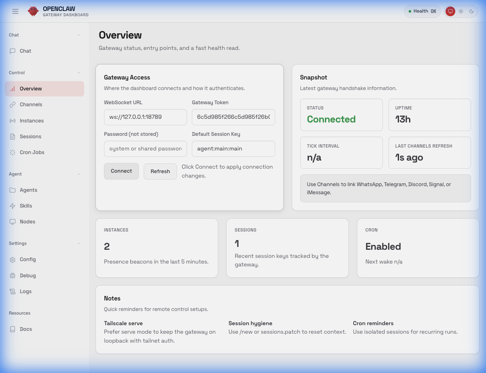 | 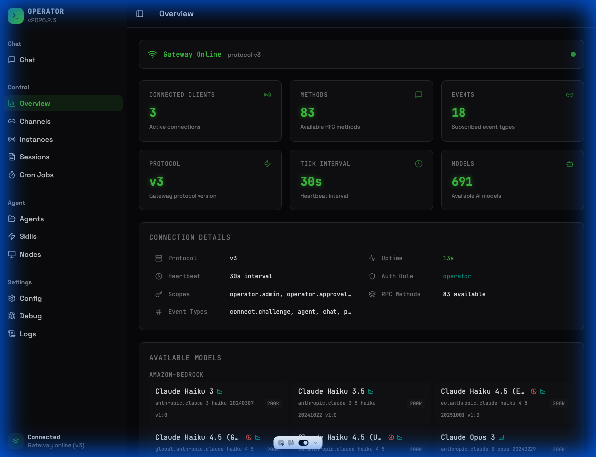         |          |

### B. Control & Management (Major Regressions)

This section has the highest number of breakages.

| Page          | Legacy UI                                               | New UI                                                               | Status         |
| :------------ | :------------------------------------------------------ | :------------------------------------------------------------------- | :------------- |
| **Channels**  | Shows Configured Channels (WhatsApp/Telegram) & Status. | **Broken.** Shows "No channel data available" even when data exists. | 🔴 **Broken**  |
| **Instances** | Lists active gateway instances/clients.                 | **Placeholder.** "Coming Soon".                                      | 🔴 **Missing** |
| **Sessions**  | List of active user sessions + "Kill" actions.          | **Empty.** "No sessions found" (Data fetch failure?).                | 🔴 **Broken**  |
| **Cron Jobs** | List of scheduled jobs + "New Job" form.                | **Empty.** "No cron jobs configured".                                | 🔴 **Broken**  |

**Visual Proof (Channels):**

- **Old UI**: Shows data.
  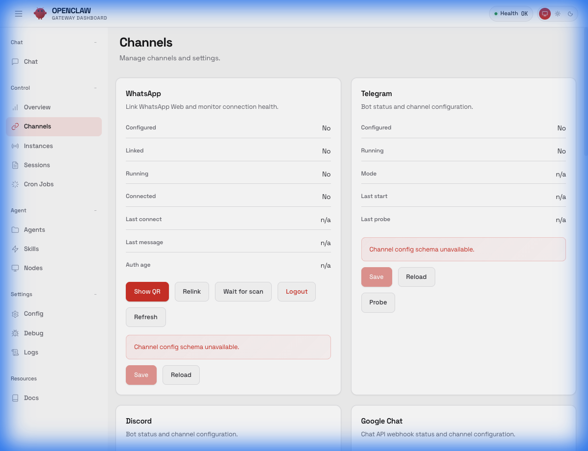
- **New UI**: Empty state.
  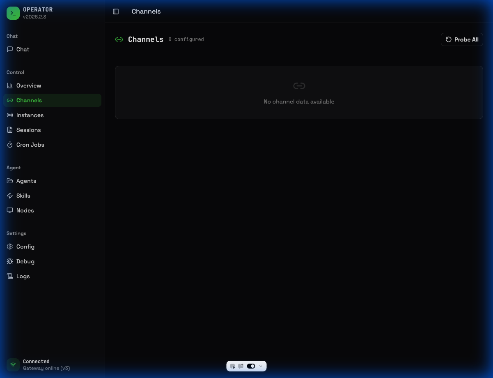

### C. Agent Resources (Deep Dive)

| Page                 | Legacy UI                                                                   | New UI                                                                       | Status            |
| :------------------- | :-------------------------------------------------------------------------- | :--------------------------------------------------------------------------- | :---------------- |
| **Agents: Overview** | Includes primary/fallback model selection, skill filters, and save actions. | Simplified view. **Missing model selection & skill filters.**                | 🟡 **Partial**    |
| **Agents: Files**    | Full file explorer & editor with preview.                                   | File list exists, but **editor/preview is empty** ("Select a file to edit"). | 🔴 **Broken**     |
| **Agents: Tools**    | Detailed permission matrix (Read/Write/Exec) & presets.                     | **Placeholder.** "Tool configuration coming soon...".                        | 🔴 **Blocking**   |
| **Agents: Skills**   | **Per-Agent** allow/deny list management tab.                               | **Missing.** Functionality moved to Global Sidebar (no per-agent config).    | 🔴 **Regression** |
| **Agents: Channels** | **Per-Agent** channel configuration tab.                                    | **Missing.** Functionality moved to Global Sidebar.                          | 🔴 **Regression** |
| **Agents: Cron**     | **Per-Agent** cron job scheduling.                                          | **Missing.** Functionality moved to Global Sidebar.                          | 🔴 **Regression** |
| **Nodes**            | Policy settings for compute nodes.                                          | **Empty.** "No nodes paired".                                                | 🔴 **Broken**     |

**Visual Proof (Agent Configuration Gaps):**

1.  **Overview & Settings**:
    - **Old UI**: Note the model selector and "Save" buttons.
      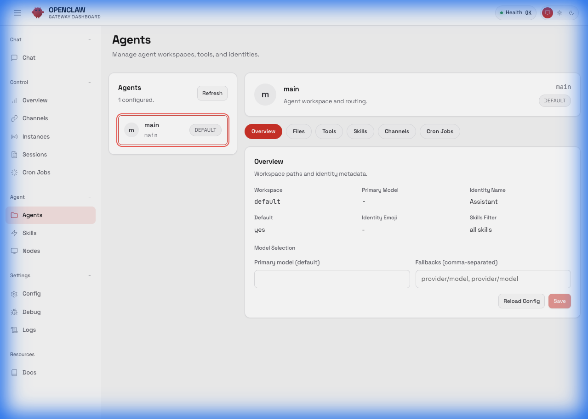
    - **New UI**: Cleaner but lacks controls.
      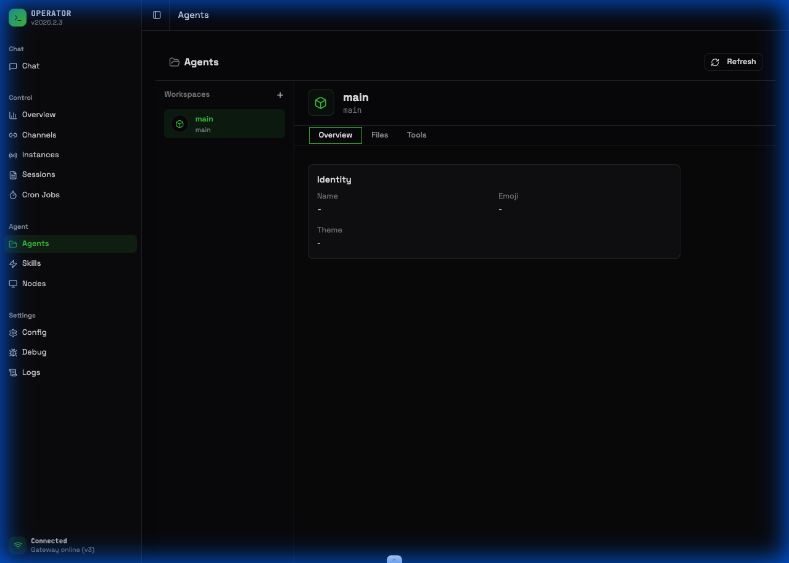

2.  **Tools Configuration (Critical)**:
    - **Old UI**: Full permission matrix.
      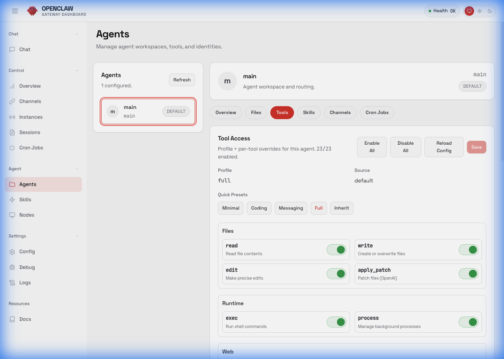
    - **New UI**: "Coming Soon" placeholder.
      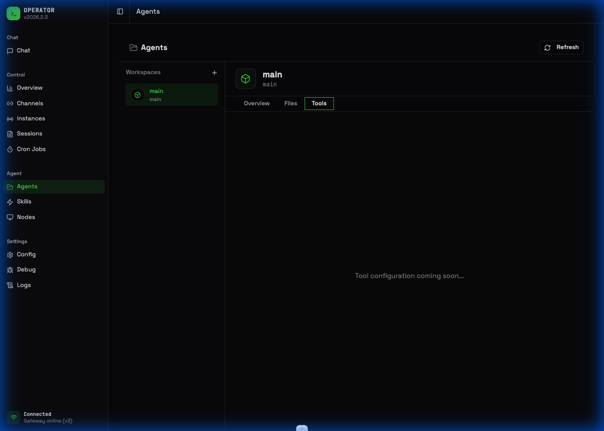

3.  **Missing Per-Agent Tabs (Skills, Channels, Cron)**:
    - The New UI removes these context-specific tabs, which is a major workflow regression.
    - _Old UI References (Missing in New UI)_:
      - **Skills**: 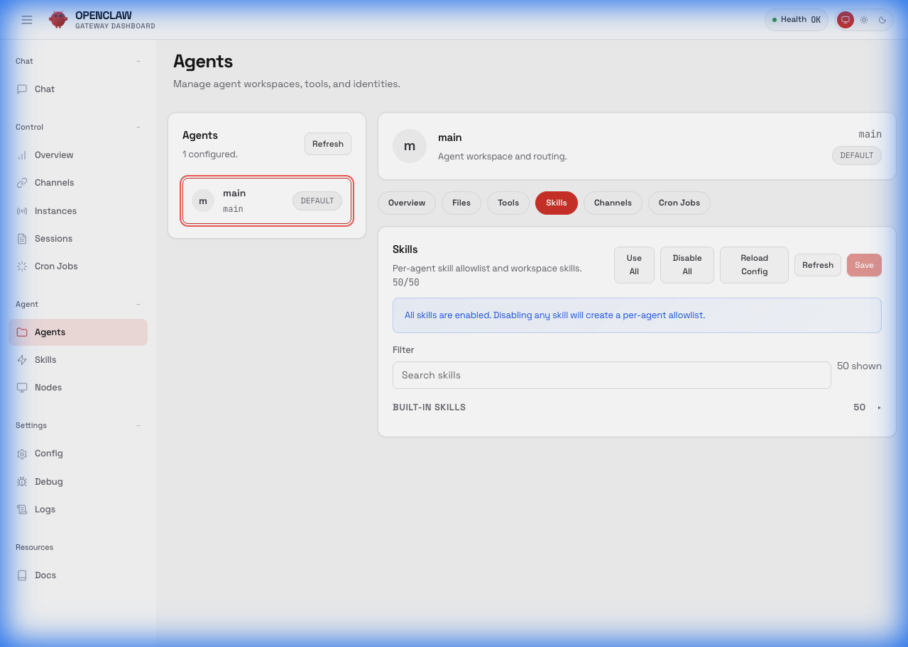
      - **Channels**: 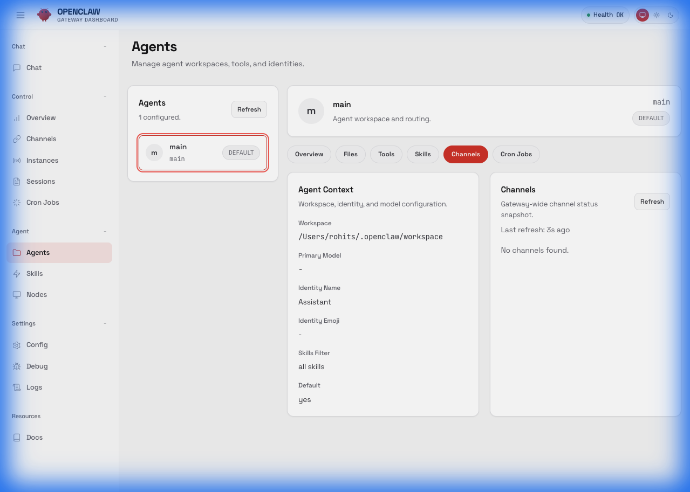
      - **Cron Jobs**: 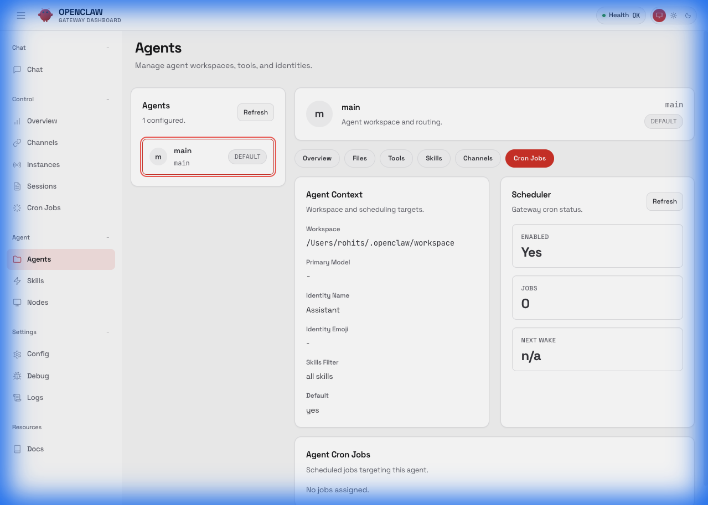

### D. Settings & Config

| Page       | Legacy UI                                             | New UI                                                         | Status            |
| :--------- | :---------------------------------------------------- | :------------------------------------------------------------- | :---------------- |
| **Config** | **Form-Based Editor.** Toggles, inputs, safe editing. | **Raw JSON Editor.** Unsafe, requires manual syntax knowledge. | 🟡 **Regression** |

**Visual Proof (Config):**

- **Old UI**: User-friendly form.
  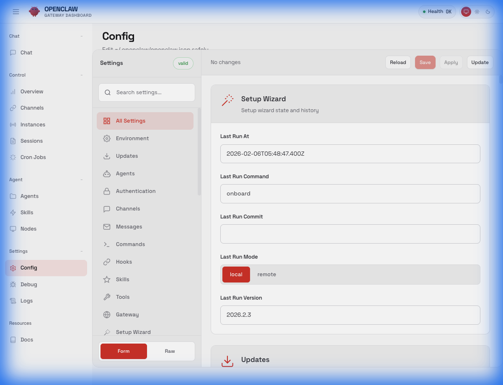
- **New UI**: Raw CodeMirror editor.
  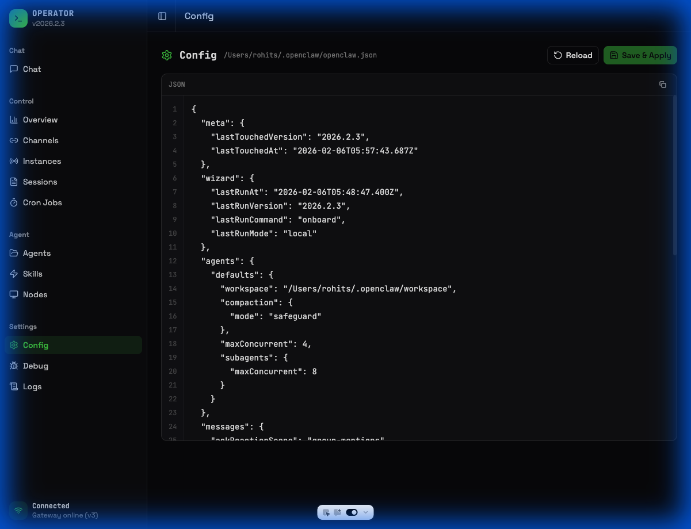

## Recommendations & Roadmap

To bring the New UI to parity:

1.  **Immediate Fix: Gateway Connection Form**
    - Port the "Gateway Access" component to the New UI Overview.
    - Allow local storage of the token so users don't need URL params.

2.  **Data Fetching Repair (Channels, Sessions, Nodes)**
    - The "Empty" states suggest the API calls are failing or the data schema has changed.
    - **Action**: Debug `useGateway` hooks in `ui-next` to ensure they can parse the legacy gateway response.

3.  **Implement Management Pages**
    - Remove "Coming Soon" from **Instances** and **Agents**.
    - Port the table views for these resources.

4.  **UX Improvement: Config**
    - The Raw JSON editor is a barrier to entry. Re-introduce a "Form View" for common settings (`general`, `llm`, etc.).
